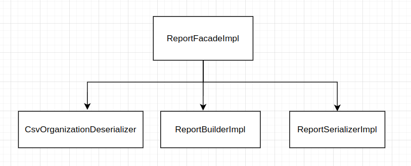

## Task

[task.pdf](task.pdf)

## Stack

- java 17
- junit 5

## Prerequisites

- java 17
- maven

## Execute tests

- `mvn test`

## Fast start

In project root default file: file1.csv is present, it will be picked up
by main class.

- `mvn clean compile exec:java`

## Principal diagram of classes

## List of assumptions

- is range for 20% and 50% is included or excluded? Current behaviour comparison is strict, and with default main
  program 20% and 50% are supposed to be allowed.
- no accuracy is provided for average calculations, double is selected, epsilon for double comparison is used (though
  double has precision loss)
- is ceo included into checks? Current behaviour: ceo is included
- input csv data is validated through all possible checks to follow fail fast approach, invalid data is not allowed
- As template for output report is not provided, developed CSV format for each block, deviations are provided for
  absolute values with accuracy of two decimals.
- report length lines are calculated including ceo, default configuration is adapted to requested.
- as max limit of 1000 rows is provided, prepared test to check timeout for report building for most heavy input data.
  Assumption: max timeout - 1 sec. (In fact works faster than 100ms)